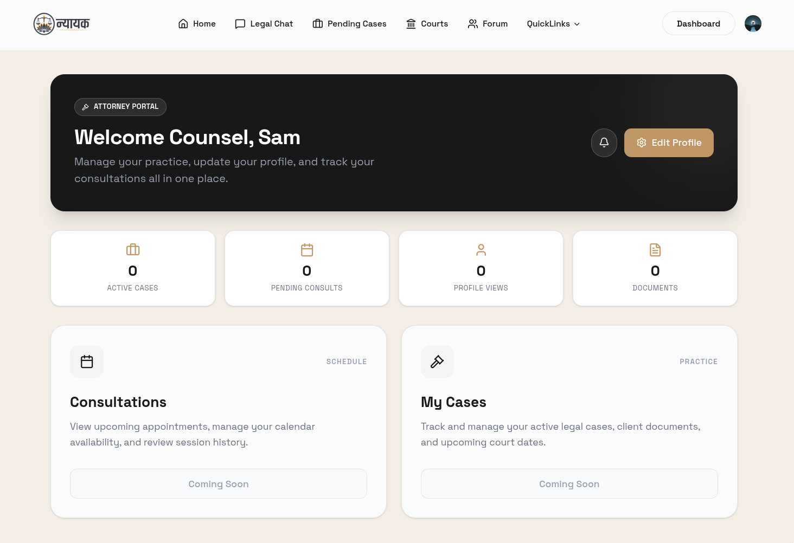
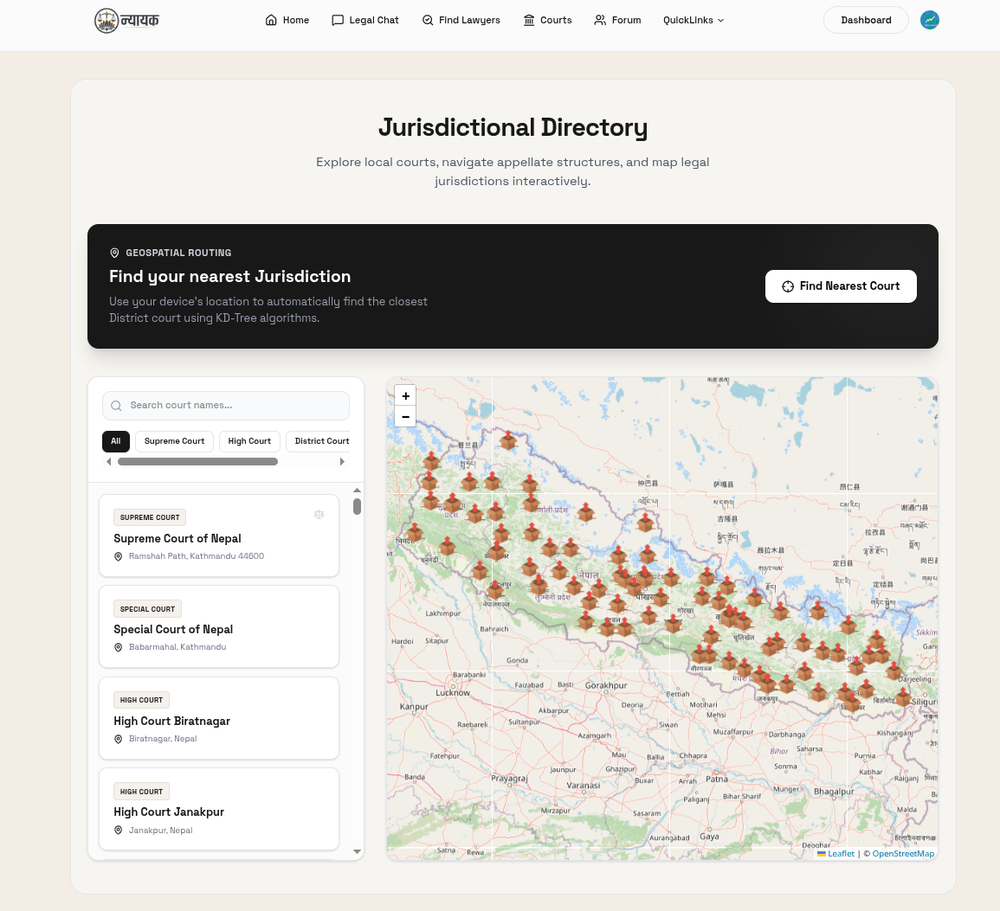

# Nyayak

Live site: https://nyayak.vercel.app

Nyayak is a digital legal navigation platform built for Nepal. It combines AI-powered legal guidance, lawyer discovery, and legal resource exploration into a single experience for citizens and legal professionals.

## Overview

The platform helps users:
- ask legal questions in natural language and receive grounded answers
- explore constitutional and legal references with citations
- discover lawyers by specialization and availability
- access court-related information and legal resources

Nyayak is designed to make legal information more accessible, especially in a setting where many people face high consultation costs and limited access to trusted legal guidance.

## Key Features

- AI legal assistant powered by a Retrieval-Augmented Generation (RAG) pipeline
- Legal query handling with source-backed responses
- Lawyer directory with specialization-based discovery
- Clerk-based authentication and user management
- Real-time data and chat workflows powered by Convex
- Modern web interface built with Next.js and Tailwind CSS

## Project Preview

Here are some representative screenshots that reflect the core experience of Nyayak:







## Tech Stack

### Frontend
- Next.js
- React
- Tailwind CSS

### Backend
- FastAPI
- Python
- LangChain
- Chroma-based document retrieval

### AI / Search
- BM25-based retrieval
- Gemini / Groq integration for answer generation

### Data & Auth
- Convex
- Clerk

## Project Structure

- frontend application: src/
- API routes: src/app/api/
- Python backend: backend/
- real-time and data models: convex/
- documentation: docs/

## Getting Started

### Prerequisites
- Node.js 20+
- Python 3.11+
- npm

### 1. Clone the repository

```bash
git clone https://github.com/paudelsamir/nyayak.git
cd nyayak
```

### 2. Install frontend dependencies

```bash
npm install
```

### 3. Set up the Python environment

```bash
python3 -m venv .venv-1
source .venv-1/bin/activate
pip install -r backend/requirements.txt
```

### 4. Configure environment variables

Create or update your environment file with the required API and service credentials:

- GEMINI_API_KEY or GROQ_API_KEY
- NEXT_PUBLIC_CLERK_PUBLISHABLE_KEY
- CLERK_SECRET_KEY
- NEXT_PUBLIC_CONVEX_URL
- CONVEX_DEPLOYMENT

A sample environment file is already present as .env.local in the repository. Update it with your own values before running the app.

### 5. Start the backend

```bash
cd backend
HOST=127.0.0.1 PORT=8000 python main.py
```

### 6. Start the frontend

In a new terminal:

```bash
cd /path/to/nyayak
npm run dev
```

Then open:

- http://localhost:3000

## API Endpoints

- GET /health
- POST /api/ask-legal

## Roadmap

- improve lawyer recommendation accuracy
- expand legal document coverage
- add richer forum and case-management workflows
- improve multilingual legal query handling

## Contributing

Contributions are welcome. If you would like to improve the platform, please open an issue or submit a pull request.

## Note

This project is actively being developed and may evolve as the product and legal data workflows are refined.